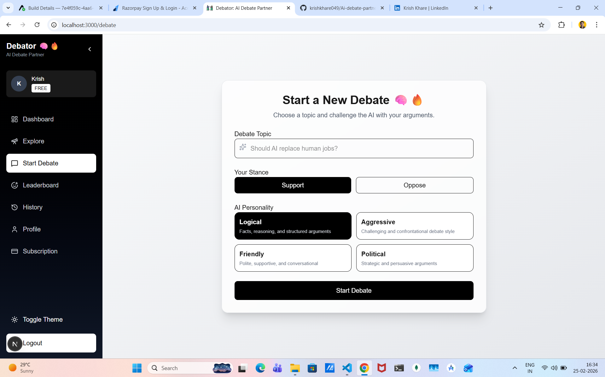
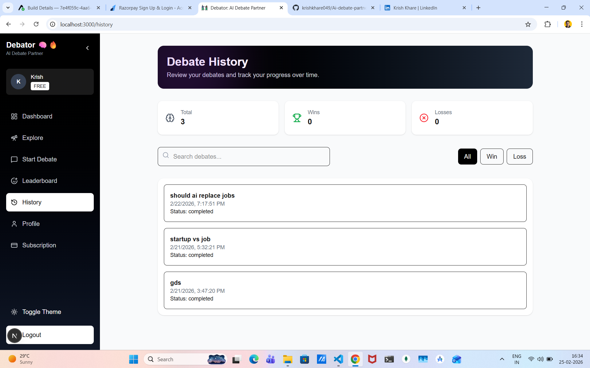

# 🧠🔥 AI Debate Partner - Debator

## 👨‍💻 Developer

**Krish Khare**  
🔗 [GitHub](https://github.com/krishkhare049)  
🔗 [LinkedIn](https://www.linkedin.com/in/krishkhare/)

---

## 🚀 Overview

**AI Debate Partner** is an intelligent web application that allows users to engage in real-time debates with an AI opponent.

It simulates structured argumentative conversations and provides feedback on:

- Logic  
- Persuasion  
- Clarity  
- Overall reasoning  

---

## 💬 Live Debate Experience

  

Engage in dynamic, real-time debates with an AI opponent that adapts to your arguments and responds intelligently using contextual understanding.

---

## ✨ Features

- 🤖 **AI-Powered Debates**  
- 💬 **Real-Time Chat Experience**  
- 🏆 **Automated Scoring System**  
- 📊 **Detailed Result Page**  
- 🔐 **Authentication System**  
- 📚 **Debate History**  
- 💳 **Subscription-Ready Architecture**  
- ⚡ **Modern UX**

---

## 📊 Results & Performance Analysis

  

After each debate, get a detailed breakdown of your performance:

- Logical strength  
- Persuasiveness  
- Clarity of arguments  
- Overall evaluation  

---

## 🏠 Clean & Modern UI

  

A smooth and responsive interface designed for focus, engagement, and usability.

---

## 🛠️ Tech Stack

### Frontend
- Next.js (App Router)
- React
- Tailwind CSS
- React Markdown
- Lucide Icons

### Backend
- Node.js
- Express.js
- MongoDB + Mongoose
- JWT Authentication

### AI Integration
- Google Gemini (`gemini-2.5-flash`)
- Custom prompt engineering  

---

## 🧩 Core Functionality

1. Start debate with topic + AI stance  
2. Real-time conversation  
3. Context-aware AI responses  
4. AI evaluates performance  
5. View results and insights  
6. Optional: publish debates  

---

## 📂 Project Structure
client/ → Next.js frontend
server/ → Express backend
models/ → MongoDB schemas
controllers/ → Route logic
services/ → AI integration
middlewares/ → Auth & subscription logic

---

## ⚙️ Environment Variables

Create a `.env` file inside `/server`:

GEMINI_API_KEY=your_api_key
MONGO_URI=your_database_url
JWT_SECRET=your_secret
RAZORPAY_KEY_ID=your_key
RAZORPAY_KEY_SECRET=your_secret

---

## 💳 Razorpay Integration

### Setup Steps

1. Add your website in Razorpay dashboard  
2. Complete account verification  
3. Enable subscriptions (AutoPay supported)  
4. Add API keys to `.env`  

### Benefits

- Free trial → paid conversion  
- Subscription-based access  
- Monetization-ready architecture  

---

## 💡 Growth Features

- 🎁 Referral system for organic traffic  
- 🏷️ Coupons & discounts  
- 📢 Shareable debate results  

---

## ▶️ Getting Started

### Install dependencies

npm install

### Run backend

npm run dev

### Run frontend

npm run dev

## ⭐ Support

If you found this useful:

👉 Star the repo  
👉 Share it with others 